# Criteo Uplift: Causal AI for Algorithmic Profit Optimization


📉

---

# 📉 Executive Summary

**The Problem:**  
Traditional A/B testing revealed that while board advertising targeting increased conversion rates by **+56%**, the high cost of media resulted in a **net loss of 0.05% per user**. The campaign was technically effective but economically disastrous.

**The Solution:**  
We architected an end-to-end Causal Inference pipeline to transition from descriptive analytics ("What happened?") to prescriptive intervention ("Who should we target?"). Using **X-Learner architectures** and **Contextual Bandits**, we isolated the sub-population of "Persuadable" users.

**The Impact:**
- **Unit Economics:** Turned negative margins into a positive outcome, reaching **0.09 profit per user**, representing a **$0.14 improvement** from the previous baseline.
- **Efficiency:** Reduced ad spend volume by **80%** while retaining **104%** of the net profit.
- **Production:** Distilled heavy meta-learners into a sub-millisecond Decision Tree for real-time bidding (RTB).

[👉 View the Live Command Center](https://ablytics.streamlit.app/)

---

# 🏗 System Architecture

The pipeline is designed for **scale (14M+ rows)**, utilizing **Polars** for memory-efficient ingestion and **LightGBM/XGBoost** for gradient-boosted causal estimation.



### The architecture is divided into five critical subsystems: **Ingestion, Integrity, Causal Learning, Economic Policy**, and **Production Serving**.

## 1. Data Ingestion & Optimization Layer
**Component:** `DataLoader (Polars)`

**Principal Rationale:**  
At $14$ million rows, standard Pandas workflows hit memory bottlenecks. We utilize **Polars** for its lazy-evaluation capabilities and columnar memory mapping.

**Optimization:**  
The pipeline enforces explicit type downcasting (**Float64 → Float32**) during ingestion. This reduces memory footprint by $~50\%$, allowing us to perform complex causal operations on a single large instance rather than requiring a distributed Spark cluster, reducing infrastructure complexity.

## 2. The Integrity Gatekeeper (Validation Layer)
**Component:** ExperimentValidator

**Principal Rationale:**  
Garbage In, Garbage Out is the primary failure mode in causal inference. Unlike supervised learning, we cannot observe the counterfactual, so we depend fully on the validity of the randomization.

**The Checks:**

**SRM (Sample Ratio Mismatch):**  
A Chi-Square test verifies that the treatment assignment mechanism wasn’t broken.

**Covariate Balance (SMD):**  
Standardized Mean Differences validate that Treatment and Control users are statistically identical before exposure.

**Logic:**  
If these checks fail, the pipeline executes an ABORT. No modeling is allowed on biased data.


## 3. Offline Causal Learning (The "Teacher")
**Component:** `X-Learner (Meta-Learner Architecture)`

**Principal Rationale:**  
We choose an X-Learner instead of T-Learner or S-Learner due to extremely low conversion rates $(<1\%)$ and frequent treatment imbalance in advertising datasets.

**Mechanism:**

**Propensity Scoring:**  
We model $P(T∣X)$ to correct for mild observational biases.

**Outcome Modeling:**  
Separate gradient-boosted models (LightGBM) are trained for Control $(μ₀)$ and Treatment $(μ₁)$.

**Imputation:**  
We impute individual treatment effects, forming “pseudo-labels” that convert the causal problem into a tractable supervised regression task.

## 4. Evaluation & Economic Policy
**Component:** `BanditSimulator & UpliftEvaluator`

**Principal Rationale:**  
Traditional accuracy metrics are insufficient for business decisions. The pipeline optimizes directly for Net Profit.

**Cost-Sensitive Learning:**  
BanditSimulator (LinUCB replay) evaluates historic scenarios by asking whether the conversion value exceeded the ad cost. This reframes the goal from maximizing clicks to maximizing ROI.

**Uncertainty Quantification:**  
UpliftEvaluator applies bootstrap resampling to generate $95\%$ confidence intervals for Qini curves, giving stakeholders a view of deployment risk.

## 5. Production Engineering (The "Student")
**Component:** DistillationEngine

**Principal Rationale:**  
The **X-Learner ensemble** has high inference cost (~100ms), which is incompatible with Real-Time Bidding environments that require responses under $10ms$.

**Knowledge Distillation:**  
The **X-Learner** acts as a Teacher. A depth-constrained Decision Tree is trained as a Student to approximate its uplift predictions.

**The Artifact:**  
The final production asset is `production_uplift_model.pkl` (the Student). This delivers:

**Speed:**  
Sub-millisecond inference time.

**Interpretability:**  
Clear rule-based structure for analysts and stakeholders.

**Regularization:**  
The simplified model smooths noise while preserving more than 95% of the Teacher’s profit performance, improving stability in production.

# 🔬 Methodology & Technical Deep Dive

### 1. Experiment Integrity (The Foundation)

- **Sample Ratio Mismatch (SRM):** Validated traffic split (85/15) using Chi-Square (p=0.9989).  
- **Covariate Balance:** Standardized Mean Differences (SMD) < 0.05 for all 12 features.

### 2. Causal Inference (X-Learner)

- **Propensity Scoring:** Model $P(T = 1 | X)$ to weight estimators.  
- **Imputation:** Estimate counterfactuals for Control and Treatment.  
- **CATE Estimation:** Predicts `τ(x) = E[Y | X, T = 1] − E[Y | X, T = 0]`


### 3. Uncertainty Quantification

- **Bootstrapped Qini Curves:** 100 resamples to generate **95% Confidence Intervals**.  
- **Result:** Lower CI bound consistently outperforms random targeting.

### 4. Economic Simulation (Contextual Bandits)

- **Logic:** Bid only when `Predicted_Uplift * LTV > Cost`.  
- **Sensitivity Analysis:** Model adapts automatically to rising CPMs, maintaining profitability at 5x cost.

### 5. Production Engineering (Distillation)

- **Technique:** Knowledge Distillation.  
- **Teacher:** X-Learner ensemble (4+ Gradient Boosted Trees)  
- **Student:** Depth-constrained Decision Tree  
- **Outcome:** Student achieves **$0.093 profit/user** vs Teacher **$0.089**, proving simpler models act as effective regularizers.

---

# 📊 Key Results

| Metric                  | Fixed A/B Strategy | Causal Bandit Strategy | Impact            |
|-------------------------|-----------------|----------------------|-----------------|
| Conversion Rate          | 0.30%           | 0.65%                | **+116%**       |
| Lift                     | +59.4%          | +350% (Top Decile)   | **6x Precision**|
| Net Profit / User        | -$0.05 (Loss)   | +$0.09 (Profit)      | **Turnaround**  |
| Inference Latency        | N/A             | <1ms                  | **RTB Ready**   |

**Insight: The "Persuadables"**  
Feature `f4` drives persuadability. Users with `f4 < 11.7` and `f3 < 3.0` (≈15% population) are micro-segmented for aggressive bidding, yielding 70% of lift.

---

# 💻 Installation & Usage

### Prerequisites

- Python 3.9+  
- 16GB RAM recommended for full dataset processing

### Clone and Install

```bash
git clone https://github.com/BhargavKumarNath/A-B-Testing.git
cd A-B-Testing
pip install -r requirements.txt
```
### Run the End-to-End Pipeline
This script handles ingestion, validation, training, simulation, and distillation.

```bash
python main.py
```
Artifacts will be saved to results/ (Models, Plots, CSVs).

### Launch the Dashboard
Access the interactive command center locally.

```bash
streamlit run app.py
```

# 📂 Project Structure
```bash
├── data/                   # Raw Parquet files (gitignored)
├── results/                # Generated artifacts (Plots, Models)
├── src/
│   ├── components/
│   │   ├── data_loader.py    # Polars Optimization
│   │   ├── validation.py     # SRM & SMD Checks
│   │   ├── statistics.py     # Frequentist ATE / CUPED
│   │   ├── models.py         # X-Learner Implementation
│   │   ├── evaluation.py     # Bootstrapped Qini
│   │   ├── segmentation.py   # Surrogate Trees
│   │   ├── bandit.py         # LinUCB Simulation
│   │   ├── distillation.py   # Student/Teacher Engine
│   │   └── main.py           # Pipeline Entry Point
│   ├── analysis/
│   │   └── baseline.py       # Baseline A/B Analysis
│   └── utils/
│       └── plotting.py       # Plotly Visualization Suite
├── app.py                  # Streamlit Dashboard Entry Point
├── tests/                  # Unit & Integration Tests for statistical checks
└── README.md               # Documentation

```

# 🛡 License & Acknowledgements
* **Dataset:** Criteo Uplift Modeling Dataset.
* **License:** MIT License.
* **Authorship:** Designed and implemented by Bhargav Kumar Nath.
