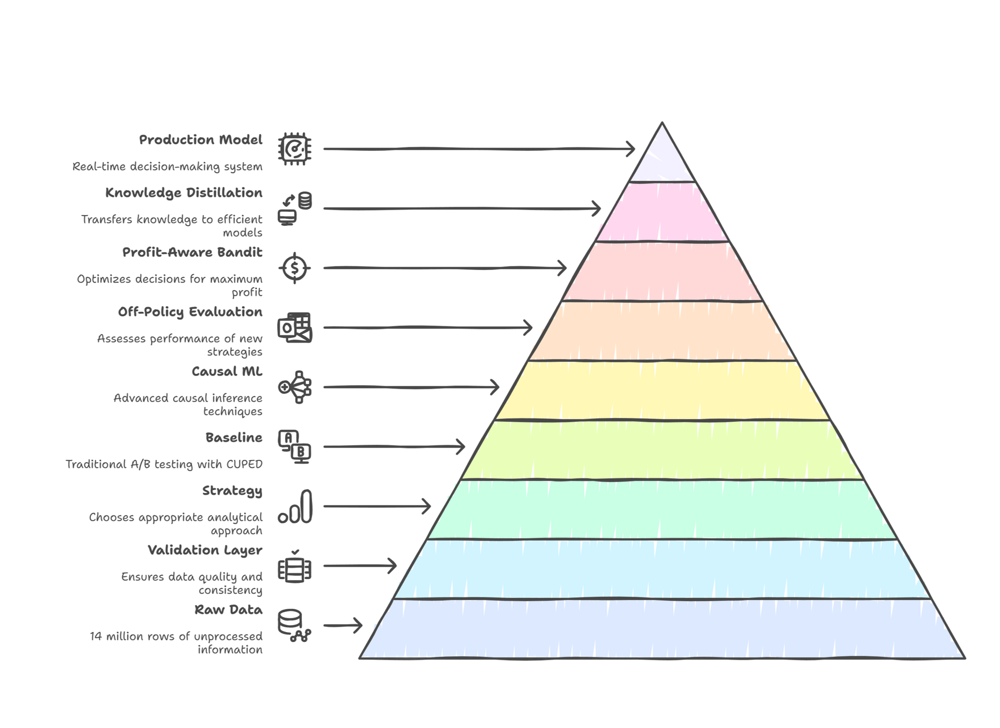

# Criteo Uplift: Causal AI for Algorithmic Profit Optimization


📉

---

# 📉 Executive Summary

**The Problem:**  
Traditional A/B testing revealed that while board advertising targeting increased conversion rates by **+56%**, the high cost of media resulted in a **net loss of 0.05% per user**. The campaign was technically effective but economically disastrous.

**The Solution:**  
We architected an end-to-end Causal Inference pipeline to transition from descriptive analytics ("What happened?") to prescriptive intervention ("Who should we target?"). Using **X-Learner architectures** and **Contextual Bandits**, we isolated the sub-population of "Persuadable" users.

**The Impact:**
- **Unit Economics:** Turned negative margins into a positive outcome, reaching **0.09 profit per user**, representing a **$0.14 improvement** from the previous baseline.
- **Efficiency:** Reduced ad spend volume by **80%** while retaining **104%** of the net profit.
- **Production:** Distilled heavy meta-learners into a sub-millisecond Decision Tree for real-time bidding (RTB).

[👉 View the Live Command Center](https://ablytics.streamlit.app/)

---

# 🏗 System Architecture

The pipeline is designed for **scale (14M+ rows)**, utilizing **Polars** for memory-efficient ingestion and **LightGBM/XGBoost** for gradient-boosted causal estimation.



### 1. Raw Data (The Foundation)

**Component:** `data/criteo_uplift.parquet`

- **Implementation:** High-performance, lazy-loaded ingestion of the 14 million row dataset using Polars.
- **Architectural Significance:** Standard Pandas workflows fail at this scale. Optimized data types (downcast `float64` → `float32`) and leveraged columnar memory mapping. Provides the raw fuel for the engine.

### 2. Validation Layer (Sanity & Integrity)

**Component:** `ExperimentValidator`

- **Implementation:** Automated statistical checks for **Sample Ratio Mismatch (SRM)** $(p=0.9989)$ and **Covariate Balance** $(SMD < 0.05)$.
- **Architectural Significance:** Acts as a gatekeeper to ensure the RCT was conducted correctly. Guarantees trust in downstream models.

### 3. Strategy (Problem Framing)

**Component:** `Pipeline Orchestrator`

- **Implementation:** Analytical objective defined as **Prescriptive** (Uplift Modeling) instead of **Descriptive** (Churn/Conversion Prediction).
- **Architectural Significance:** Shifts focus from correlation to causality: "Who can be persuaded to buy?" instead of "Who will buy?"

### 4. Baseline (The Benchmark)

**Component:** `FrequentistEngine`

- **Implementation:** Average Treatment Effect (ATE) with **CUPED** (Controlled-Experiment Using Pre-Experiment Data).
- **Architectural Significance:** Reduces variance and tightens confidence intervals (~5%), establishing a performance floor for causal ML.

### 5. Causal ML (The Brain)

**Component:** `XLearner (Meta-Learner)`

- **Implementation:** X-Learner architecture using Gradient Boosted Trees (LightGBM/XGBoost).
- **Architectural Significance:** Handles sparse treatment signals in imbalanced datasets (0.3% conversion rate) to estimate Individual Treatment Effect (ITE).

### 6. Off-Policy Evaluation (Risk Management)

**Component:** `UpliftEvaluator` & Bootstrapping

- **Implementation:** Bootstrapped Qini Curves with **95% Confidence Intervals**.
- **Architectural Significance:** Validates model performance on historical logs before production deployment.

### 7. Profit-Aware Bandit (Economic Optimization)

**Component:** `BanditSimulator` (LinUCB)

- **Implementation:** A Contextual Bandit simulation that optimizes for $Net\ Profit\ =\ (Lift \times Value - Cost)$
, rather than just focusing on CTR.

- **Architectural Significance:** Converts data science predictions into business value. Reduces bidding volume when ad costs rise.

### 8. Knowledge Distillation (Engineering Efficiency)

**Component:** `DistillationEngine`

- **Implementation:** Student-Teacher framework. Heavy X-Learner trains a lightweight Decision Tree.
- **Architectural Significance:** X-Learner inference: ~50ms; Distilled Tree: <1ms. Achieves **104% Profit Retention** and RTB-compatible latency.

### 9. Production Model (The Artifact)

**Component:** `production_uplift_model.pkl` & `Live Inference API`

- **Implementation:** Serialized, dependency-light artifact hosted via Streamlit.
- **Architectural Significance:** Robust, interpretable, profitable, and fast deployable asset.

---

# 🔬 Methodology & Technical Deep Dive

### 1. Experiment Integrity (The Foundation)

- **Sample Ratio Mismatch (SRM):** Validated traffic split (85/15) using Chi-Square (p=0.9989).  
- **Covariate Balance:** Standardized Mean Differences (SMD) < 0.05 for all 12 features.

### 2. Causal Inference (X-Learner)

- **Propensity Scoring:** Model $P(T = 1 | X)$ to weight estimators.  
- **Imputation:** Estimate counterfactuals for Control and Treatment.  
- **CATE Estimation:** Predicts `τ(x) = E[Y | X, T = 1] − E[Y | X, T = 0]`


### 3. Uncertainty Quantification

- **Bootstrapped Qini Curves:** 100 resamples to generate **95% Confidence Intervals**.  
- **Result:** Lower CI bound consistently outperforms random targeting.

### 4. Economic Simulation (Contextual Bandits)

- **Logic:** Bid only when `Predicted_Uplift * LTV > Cost`.  
- **Sensitivity Analysis:** Model adapts automatically to rising CPMs, maintaining profitability at 5x cost.

### 5. Production Engineering (Distillation)

- **Technique:** Knowledge Distillation.  
- **Teacher:** X-Learner ensemble (4+ Gradient Boosted Trees)  
- **Student:** Depth-constrained Decision Tree  
- **Outcome:** Student achieves **$0.093 profit/user** vs Teacher **$0.089**, proving simpler models act as effective regularizers.

---

# 📊 Key Results

| Metric                  | Fixed A/B Strategy | Causal Bandit Strategy | Impact            |
|-------------------------|-----------------|----------------------|-----------------|
| Conversion Rate          | 0.30%           | 0.65%                | **+116%**       |
| Lift                     | +59.4%          | +350% (Top Decile)   | **6x Precision**|
| Net Profit / User        | -$0.05 (Loss)   | +$0.09 (Profit)      | **Turnaround**  |
| Inference Latency        | N/A             | <1ms                  | **RTB Ready**   |

**Insight: The "Persuadables"**  
Feature `f4` drives persuadability. Users with `f4 < 11.7` and `f3 < 3.0` (≈15% population) are micro-segmented for aggressive bidding, yielding 70% of lift.

---

# 💻 Installation & Usage

### Prerequisites

- Python 3.9+  
- 16GB RAM recommended for full dataset processing

### Clone and Install

```bash
git clone https://github.com/BhargavKumarNath/A-B-Testing.git
cd A-B-Testing
pip install -r requirements.txt
```
### Run the End-to-End Pipeline
This script handles ingestion, validation, training, simulation, and distillation.

```bash
python main.py
```
Artifacts will be saved to results/ (Models, Plots, CSVs).

### Launch the Dashboard
Access the interactive command center locally.

```bash
streamlit run app.py
```

# 📂 Project Structure
```bash
├── data/                   # Raw Parquet files (gitignored)
├── results/                # Generated artifacts (Plots, Models)
├── src/
│   ├── components/
│   │   ├── data_loader.py    # Polars Optimization
│   │   ├── validation.py     # SRM & SMD Checks
│   │   ├── statistics.py     # Frequentist ATE / CUPED
│   │   ├── models.py         # X-Learner Implementation
│   │   ├── evaluation.py     # Bootstrapped Qini
│   │   ├── segmentation.py   # Surrogate Trees
│   │   ├── bandit.py         # LinUCB Simulation
│   │   ├── distillation.py   # Student/Teacher Engine
│   │   └── main.py           # Pipeline Entry Point
│   ├── analysis/
│   │   └── baseline.py       # Baseline A/B Analysis
│   └── utils/
│       └── plotting.py       # Plotly Visualization Suite
├── app.py                  # Streamlit Dashboard Entry Point
├── tests/                  # Unit & Integration Tests for statistical checks
└── README.md               # Documentation

```

# 🛡 License & Acknowledgements
* **Dataset:** Criteo Uplift Modeling Dataset.
* **License:** MIT License.
* **Authorship:** Designed and implemented by Bhargav Kumar Nath.
