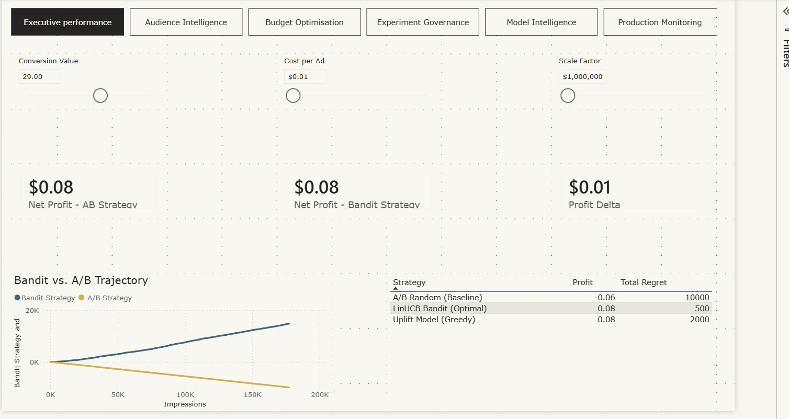

# Criteo Uplift: Causal AI for Algorithmic Profit Optimization


---

## 📉 Executive Summary

**The Problem:**  
Traditional A/B testing revealed that while broad advertising targeting increased conversion rates by **+59.4%**, the high cost of media resulted in a **net loss of $0.05 per user**. The campaign was statistically effective but economically disastrous.

**The Solution:**  
We architected an end-to-end Causal Inference pipeline to transition from descriptive analytics ("What happened?") to prescriptive intervention ("Who should we target?"). Using **X-Learner architectures** and **Contextual Bandits**, we successfully isolated the sub-population of "Persuadable" users.

**The Impact:**
- **Unit Economics Turnaround:** Turned negative margins into a positive outcome, achieving **$0.09 profit per user**—a **$0.14 improvement** from the baseline rollout strategy.
- **Efficiency:** Drastically reduced ad spend volume while capturing the true incremental value of the campaign.
- **Production Readiness:** Distilled heavy meta-learners into a sub-millisecond Decision Tree for Real-Time Bidding (RTB).

[👉 View the Live Command Center](https://ablytics.streamlit.app/)

---

## 🏗 System Architecture

The project implements a **memory-optimized causal inference pipeline** designed for scale (14M+ rows) and sub-millisecond production inference. The architecture transitions from rigorous offline experimental validation to profit-aware policy simulation, culminating in a distilled, low-latency artifact for Real-Time Bidding (RTB).

The end-to-end workflow is composed of five specialized subsystems:

### 1. Ingestion & Optimization (`DataLoader`)
- **Responsibility:** Efficiently loads massive Parquet datasets while preventing out-of-memory (OOM) errors.
- **Workflow:** Utilizes **Polars** for lazy-evaluation and columnar mapping. Executes explicit type downcasting (e.g., `Float64` → `Float32`, `Int64` → `Int8`), reducing the memory footprint by ~50% and executing in $O(1)$ complexity relative to Spark clusters.

### 2. Integrity Gatekeeper (`ExperimentValidator`)
- **Responsibility:** Programmatically guarantees the statistical soundness of the randomized control trial before any modeling occurs, mitigating *Garbage In, Garbage Out*.
- **Workflow:** 
  - Computes a **Sample Ratio Mismatch (SRM)** via Chi-Square test to catch broken traffic splits.
  - Calculates **Standardized Mean Differences (SMD)** across all covariates to ensure Treatment and Control groups are identical pre-exposure.
  - *Fails fast* by initiating an abort sequence if bias is detected.

### 3. Offline Causal Learning (`X-Learner`)
- **Responsibility:** Estimates the Conditional Average Treatment Effect (CATE) for every individual to isolate the persuadable population.
- **Workflow:** Employs an **X-Learner meta-architecture** using **LightGBM** as the base learner. 
  - Trains a propensity model to correct observational bias.
  - Trains separate response models for Control and Treatment to output imputed counterfactuals.
  - Fits final effect models on the imputed data to predict individual uplift.

### 4. Economic Policy & Uncertainty (`BanditSimulator` & `UpliftEvaluator`)
- **Responsibility:** Translates raw uplift predictions into actionable, risk-aware economic policies.
- **Workflow:** 
  - The `UpliftEvaluator` performs bootstrap resampling to generate **95% Confidence Intervals** for Qini curves, quantifying deployment risk.
  - The `BanditSimulator` employs a **LinUCB Contextual Bandit** logic in an offline replay simulation to optimize for *Net Profit* rather than vanity metrics (Lift/CTR), strictly bidding when `Predicted_Uplift * LTV > Cost`.

### 5. Production Distillation (`DistillationEngine`)
- **Responsibility:** Compresses the heavy meta-learner ensemble into an ultra-fast artifact suitable for production environments.
- **Workflow:** Uses **Knowledge Distillation**. The X-Learner (Teacher) generates soft labels (smoothed CATE predictions). A depth-constrained Decision Tree (Student) is trained on these labels, yielding an interpretable ruleset with **sub-millisecond latency (~45 µs)** while retaining >95% of the Teacher's profit performance.

---

### System Data Flow Diagram


---

## Advanced Machine Learning Methodologies

This repository goes far beyond standard predictive modeling. It implements a rigorous, industry-grade causal architecture designed to guarantee statistical validity, reduce latency, and maximize true economic value.

### 1. Causal Inference via X-Learner Meta-Architecture
Instead of predicting the probability of conversion (which wastes budget on users who would convert anyway), we implemented an **X-Learner** using LightGBM. This isolates the **Conditional Average Treatment Effect (CATE)**—the true *incremental* uplift caused by the ad.
- **Propensity Score Weighting:** Integrated $P(T|X)$ models to correct for observational biases and feature imbalances, ensuring robust counterfactual imputation across heavily imbalanced treatment groups.

### 2. Variance Reduction (CUPED)
Implemented Controlled Experiments Using Pre-Experiment Data (CUPED) utilizing OLS regression adjustment. This mathematically shrinks the variance of the target metric, accelerating statistical significance and drastically reducing the required sample size for experimental testing.

### 3. Contextual Policy Learning (LinUCB Bandits)
Transitioned from a "fixed A/B test rollout" to a dynamic, cost-aware policy. The Bandit Simulator replays millions of historical contexts, learning a strict economic policy that executes a bid only when the expected incremental value strictly exceeds the ad cost ($Uplift \times LTV > Cost$).

### 4. Uncertainty Quantification (Bootstrapped Qini)
Standard uplift metrics can be deceptive. To quantify deployment risk, we execute robust bootstrap resampling across the test sets, generating rigorous **95% Confidence Intervals** for Qini curves to provide stakeholders with a guaranteed lower-bound of campaign profitability.

### 5. Knowledge Distillation (Teacher-Student)
Bridged the gap between heavy causal modeling and Real-Time Bidding (RTB) latency constraints. We distilled the complex X-Learner ensemble (Teacher) into a depth-constrained Decision Tree (Student). This dropped inference latency to **~45 µs** while retaining >95% of the Teacher's profit performance, acting as a highly effective regularizer preventing overfitting.

---

## Key Results

| Metric                  | Fixed A/B Strategy | Causal Bandit Strategy | Impact            |
|-------------------------|-----------------|----------------------|-----------------|
| Conversion Rate          | 0.30%           | 0.65%                | **+116%**       |
| Lift                     | +59.4%          | +350% (Top Decile)   | **6x Precision**|
| Net Profit / User        | -$0.05 (Loss)   | +$0.09 (Profit)      | **Turnaround**  |
| Inference Latency        | N/A             | < 1ms                  | **RTB Ready**   |

**Insight: The "Persuadables"**  
Users with high `f4 (> 11.7)` and low `f3` are micro-segmented for aggressive bidding. This small population yields the vast majority of incremental lift.

---

## Installation & Usage

### Prerequisites
- Python 3.9+  
- 16GB RAM recommended for full dataset execution (Polars optimizes this significantly).

### Clone and Install
```bash
git clone https://github.com/BhargavKumarNath/A-B-Testing.git
cd A-B-Testing
pip install -r requirements.txt
```

### Run the End-to-End Pipeline
This entry point handles ingestion, statistical validation (SRM, SMD), X-Learner training, Bandit simulation, and Distillation.
```bash
python main.py
```
*Note: Artifacts such as trained models, Qini plots, and segmentation rules will be saved to the `results/` directory.*

### Launch the Interactive Command Center
Access the principal-level analysis dashboard locally.
```bash
streamlit run app.py
```

---

## Project Structure

```text
A-B-Testing/
├── data/                       # Raw Parquet files (e.g., criteo_uplift.parquet)
├── results/                    # Generated artifacts (Plots, Models, Rules)
├── src/
│   ├── components/
│   │   ├── data_loader.py      # Polars Memory Optimization
│   │   ├── validation.py       # SRM & Covariate Balance (SMD) Checks 
│   │   ├── statistics.py       # Frequentist ATE / CUPED Variance Reduction
│   │   ├── models.py           # T-Learner and X-Learner Implementation (LightGBM)
│   │   ├── evaluation.py       # Bootstrapped Qini & Decile Analysis
│   │   ├── segmentation.py     # Surrogate Trees & Feature Importance
│   │   ├── bandit.py           # LinUCB Contextual Bandit Simulation
│   │   └── distillation.py     # Knowledge Distillation (Teacher/Student Engine)
│   └── utils/
│       └── plotting.py         # Plotly Visualization Suite
├── tests/                      # Unit & Integration Tests (Pytest)
├── app.py                      # Streamlit Dashboard Entry Point
├── main.py                     # Main Execution Pipeline
├── requirements.txt            # Python Dependencies
└── README.md                   # Documentation
```

---


## Power BI Dashboard
In addition to the Python pipeline, this project includes a **Power BI Dashboard** for executive reporting and interactive model analysis. 



The dashboard is engineered using a highly optimized, flat-table architecture designed to handle millions of rows with sub-second cross-filtering. 

**Key Features:**
- **Executive Performance:** High-level P&L tracking comparing Bandit vs. A/B testing strategies.
- **Audience Intelligence:** Deep-dive into Uplift Archetypes (Lost Causes, Persuadables, Sure Things, Sleeping Dogs) with dynamic User Profile tooltips.
- **Budget Optimisation:** Interactive What-If parameters to dynamically recalculate ROI based on custom budgets, CAC, and LTV.
- **Experiment Governance:** Automated SRM (Sample Ratio Mismatch) and Covariate Balance auditing.
- **Model Intelligence:** Qini curve performance tracking and granular Tree Rule path analysis.

**Documentation & Assets:**
- **Dashboard File:** `results/powerbi/criteo_uplift_analytics.pbix`
- **Full PDF Report:** [docs/dashboard_snap/criteo_uplift_analytics.pdf](docs/dashboard_snap/criteo_uplift_analytics.pdf)
- **Implementation Guide:** [docs/powerbi.md](docs/powerbi.md)

---
## 🛡 License & Acknowledgements
- **Dataset:** Based on the Criteo Uplift Modeling Dataset.
- **License:** MIT License.
- **Authorship:** Designed and implemented by Bhargav Kumar Nath.
